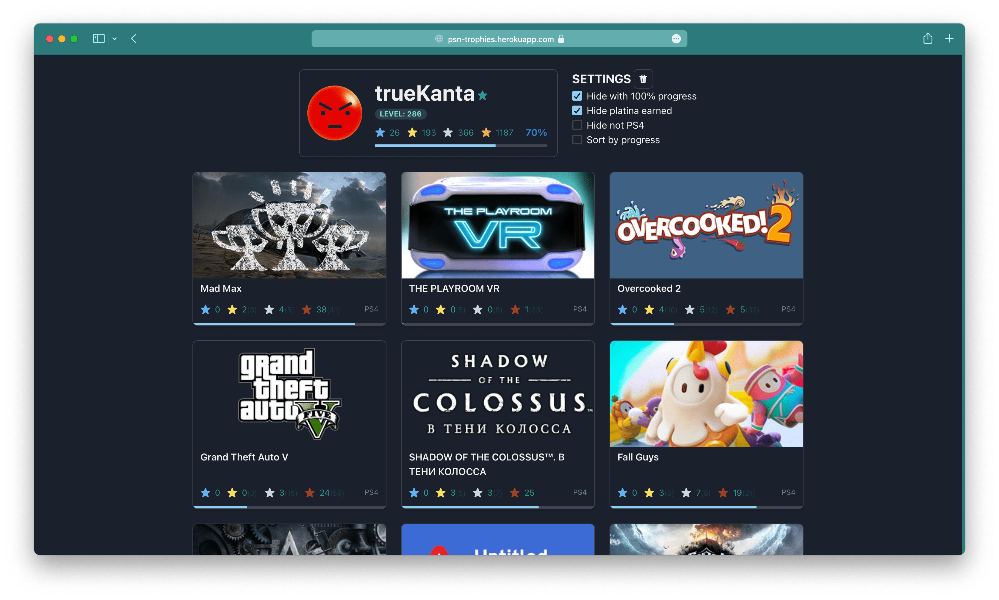

# psn-trophies

https://psn-trophies.herokuapp.com/ <-- free instance, long first loading, need wait ~30 sec

## Check your PSN progress, with a description of getting trophies



```sh
# check .env.example.local
pnpm r # run redis
pnpm dev # run dev
```

## todo-list

- [ ] "got top" btn on game page
- [ ] show special notice
- [ ] pwa offline/online message
- [ ] "/login" token expire handling
- [ ] improve eslint rules
- [ ] check all "ts-ignore", "TODO", "FIXME"
- [ ] add Storybook
